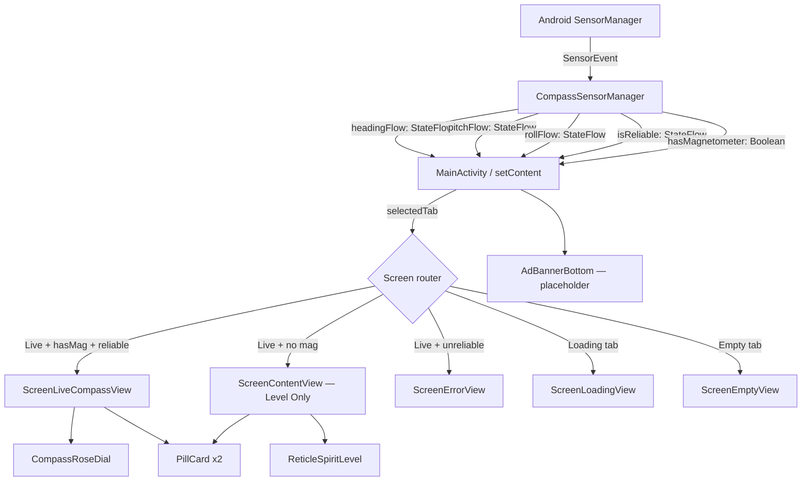

# Architecture — Compass & Level

## Shape

Single `Activity` (`MainActivity`), Jetpack Compose UI, no ViewModel — sensor state flows
directly from `CompassSensorManager` into the `@Composable` tree via `StateFlow.collectAsState()`.
One sensor manager owns both the magnetometer/rotation-vector path and the accelerometer-only
fallback; the UI switches between four screen composables based on `hasMagnetometer` and
`isReliable` flags.

## Diagram

## Decisions

| # | Decision | Why | What we gave up |
|---|---|---|---|
| 1 | Jetpack Compose, not Views | Single screen, no legacy; Compose Canvas gives full draw control for the compass rose | Team's familiarity with XML layouts |
| 2 | `StateFlow` in `CompassSensorManager`, no ViewModel | One activity, no configuration-change survival needed for sensor state; ViewModel would add a layer with no benefit | Automatic state survival across rotation (mitigated: sensors restart on resume anyway) |
| 3 | `TYPE_ROTATION_VECTOR` primary, `TYPE_ACCELEROMETER` + `TYPE_MAGNETIC_FIELD` fallback | Rotation vector is fused and more stable; raw mag+accel required on older hardware without fusion | ~2-3° extra accuracy on devices that only have the raw sensors |
| 4 | Exponential moving average (α = 0.15) on all sensor outputs | Eliminates high-frequency MEMS jitter without a ring buffer; single multiply per frame | Slightly slower response to fast rotation vs. a raw reading |
| 5 | minSdk 24 (Android 7.0) | ~97% device coverage [certain — developer.android.com/about/dashboards]; `TYPE_ROTATION_VECTOR` available since API 9 | Android 5–6 users |
| 6 | No GPS / location permissions | Core utility works purely from inertial sensors; avoids runtime permission dialog entirely | True North (requires declination lookup, which needs location) |
| 7 | `compileSdk 36`, `targetSdk 36` | Required by Play Store for new submissions after Aug 2025 [certain — https://support.google.com/googleplay/android-developer/answer/11926878] | None meaningful |
| 8 | Debug tab bar (`StateSelectorBar`) kept in the build | Allows QA of all four screen states without faking hardware conditions | 5 tabs visible to end users in current build — must be removed or gated before production release |

## Data

| What | Stored where | Survives uninstall? |
|---|---|---|
| Sensor readings (heading, pitch, roll, reliability) | In-memory `StateFlow` only | No |
| `hasMagnetometer` flag | In-memory Boolean, set once on init | No |
| Selected UI tab | `remember { mutableStateOf("Live") }` in Compose | No — resets on every launch |
| User settings (True/False North, declination, units) | Not yet built | N/A |

## Third-party dependencies

| Library | Version | Why | What breaks without it |
|---|---|---|---|
| `androidx.core:core-ktx` | 1.10.1 | Kotlin extensions for system services | Minor; replaceable with Java API calls |
| `androidx.lifecycle:lifecycle-runtime-ktx` | 2.6.1 | `lifecycleScope` for coroutine lifetime binding | Sensor flows would need manual coroutine management |
| `androidx.activity:activity-compose` | 1.8.0 | `setContent {}` and `ComponentActivity` | Compose cannot be hosted |
| `androidx.compose:compose-bom` | 2026.02.01 | Version-pins all Compose artifacts consistently | Version conflicts between Compose libs |
| `androidx.compose.ui:ui` | BOM-managed | Core Compose runtime and layout | Everything |
| `androidx.compose.ui:ui-graphics` | BOM-managed | `Canvas`, `DrawScope`, `Brush`, `Path` | Compass rose and spirit level drawing |
| `androidx.compose.material3:material3` | BOM-managed | `MaterialTheme`, `Text`, `darkColorScheme` | Theme and text rendering |

No AdMob, no Firebase, no Maps SDK, no network dependency. The app is fully offline. [certain]

## Threading

| What | Thread | Why |
|---|---|---|
| `SensorEventListener.onSensorChanged` | Android sensor thread (system-managed) | Required — Android delivers sensor events on a dedicated thread |
| `StateFlow.value` write (heading/pitch/roll) | Sensor thread → `StateFlow` | `MutableStateFlow` is thread-safe; no explicit dispatch needed |
| Compose recomposition | Main thread | Standard; Compose reads `StateFlow` via `collectAsState()` which posts to main |
| Everything else | Main thread | No disk, no network, no background work |

## Known weaknesses

1. ~~**Debug tab bar ships in release builds.** `StateSelectorBar` exposes `Loading / Content / Empty / Error / Live` to all users.~~ *[Resolved 2026-09-22: Replaced with commercial `SegmentedModeSelector` (Compass vs Spirit Level) and modal settings screen.]*

2. **Alpha filter coefficient α = 0.18 with `SENSOR_DELAY_GAME`.** Upgraded to 60fps high-rate sampling with shortest-angular-delta wrapping ($((\Delta + 540) \pmod{360}) - 180$) to eliminate 359°–0° snap spin. Fine for v1; move to a per-device adaptive filter if compass lag complaints arrive.

3. ~~**No heading-hold buffer when accuracy drops to `UNRELIABLE`.** SPEC.md specified: "Dial freezes at last known good heading when accuracy drops to UNRELIABLE."~~ *[Resolved 2026-09-22: `CompassSensorManager` implements a heading-hold buffer locking `lastKnownGoodHeading` when accuracy drops to UNRELIABLE.]*

4. **`isMinifyEnabled = false` in release build type.** APK is not minified or obfuscated. Fine for a debug build; must be set to `true` before a Play Store release to reduce APK size and obscure class names.

5. ~~**Settings screen not built.** SPEC.md Day 2 items (Magnetic vs. True North toggle, manual declination input, sensor health dialog) are unimplemented.~~ *[Resolved 2026-09-22: Implemented `ScreenSettingsView` with Magnetic vs. True North toggle, manual declination adjust, angle units (% grade vs degrees), and zero-permission privacy notice.]*

## What I would change with more time

- Add a `SettingsRepository` backed by `DataStore<Preferences>` to persist True/False North and declination across reboots (currently preserved in in-memory StateFlow).
- Add full integration with AdMob SDK once AdMob App ID is issued by console lead.
- Write a proper `@Preview` for each screen composable so designers can iterate without building.
