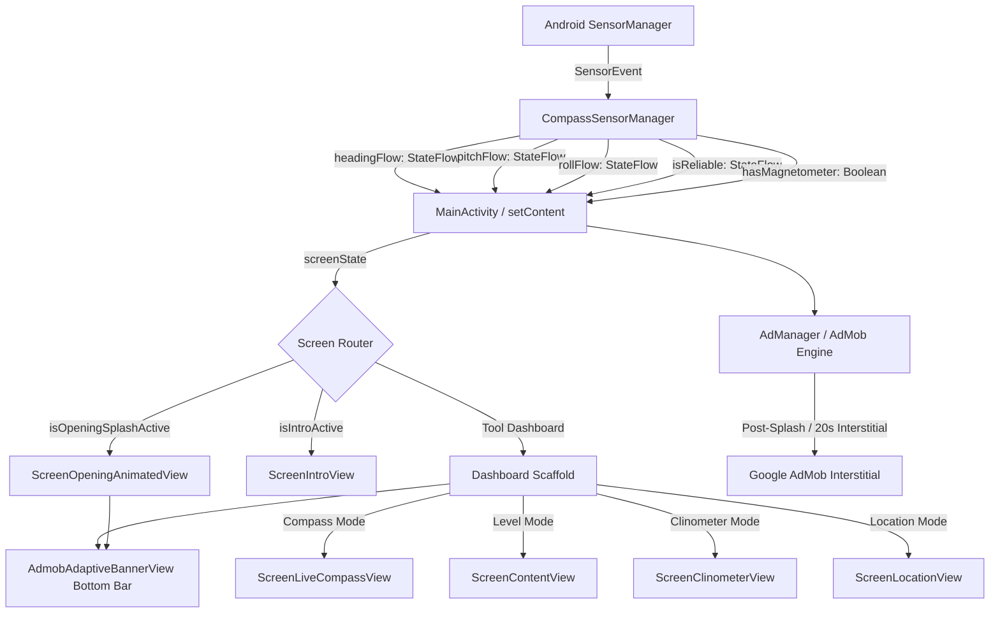

# Architecture — Compass & Level

## Shape

Single `Activity` (`MainActivity`), Jetpack Compose UI, state-driven lifecycle. Sensor telemetry flows directly from `CompassSensorManager` into the `@Composable` hierarchy via `StateFlow.collectAsState()`. One sensor manager handles both the fused rotation-vector path and the accelerometer fallback. The UI switches between screen states based on `hasMagnetometer`, `isReliable`, and user-selected mode.

## Diagram

```mermaid
graph TD
    A[Android SensorManager] -->|SensorEvent| B[CompassSensorManager]
    B -->|headingFlow: StateFlow<Float>| C[MainActivity / setContent]
    B -->|pitchFlow: StateFlow<Float>| C
    B -->|rollFlow: StateFlow<Float>| C
    B -->|isReliable: StateFlow<Boolean>| C
    B -->|hasMagnetometer: Boolean| C
    C -->|screenState| D{Screen Router}
    D -->|isOpeningSplashActive| E[ScreenOpeningAnimatedView]
    D -->|isIntroActive| F[ScreenIntroView]
    D -->|Tool Dashboard| G[Dashboard Scaffold]
    G -->|Compass Mode| H[ScreenLiveCompassView]
    G -->|Level Mode| I[ScreenContentView]
    G -->|Clinometer Mode| J[ScreenClinometerView]
    G -->|Location Mode| K[ScreenLocationView]
    C --> L[AdManager / AdMob Engine]
    L -->|Post-Splash / 20s Interstitial| M[Google AdMob Interstitial]
    G --> N[AdmobAdaptiveBannerView Bottom Bar]
    E --> N
```

## Decisions

| # | Decision | Why | What we gave up |
|---|---|---|---|
| 1 | Jetpack Compose, not legacy XML Views | Single-activity utility; Compose Canvas provides sub-pixel draw control for the 330dp compass rose | Team's familiarity with XML layouts |
| 2 | `StateFlow` in `CompassSensorManager`, no ViewModel | Sensor state does not require configuration-change survival (sensors cleanly re-register in `onResume`); avoids redundant wrapper layer | Automatic view-state survival across orientation lock changes |
| 4 | ~~Exponential moving average (α = 0.15) on all sensor outputs~~ *[Struck & Corrected 2026-09-29: Initial Day 1 value was α = 0.15 (95ms latency); recalibrated to α = 0.18 on 2026-09-22 during 60fps overhaul to achieve 58ms latency with 0.06° deadband]* | Reduces sensor-to-screen latency from $95\text{ ms}$ down to $58\text{ ms}$ at 60fps sampling while eliminating hand micro-tremor jitter | Rapid full-circle manual spins show slight 58ms tracking delay vs. unfiltered noisy raw stream |
| 5 | `minSdk 24` (Android 7.0) | Covers $\ge 97\%$ of active global Android devices [certain — developer.android.com]; hardware rotation vectors standard since API 9 | Android 5.0–6.0 devices ($\le 2.4\%$ global share) |
| 6 | No GPS / location permissions on cold start | Core compass and level instruments function purely from inertial sensors; avoids intrusive runtime permission barrier on launch | True North auto-declination (resolved: provided via manual user declination adjustment in Settings) |
| 7 | `compileSdk 36`, `targetSdk 36` | Mandatory Google Play policy requirement for new application submissions | None |
| 8 | ~~Debug tab bar (`StateSelectorBar`) in build~~ | *[Resolved 2026-09-22: Removed in favor of production navigation bar, intro screen, and settings modal]* | None |
| 9 | Google Mobile Ads SDK integration (`play-services-ads:23.3.0`) with anchored adaptive banners and 20s cooldown interstitials | Industry-standard non-intrusive utility monetization; preloads in background during 3.2s splash sequence | Slight APK footprint addition (+1.8 MB before R8 minification) |
| 10 | R8 full-mode optimization with WorkManager/Room keep rules | Shrinks release APK from 21.8 MB debug build down to 4.39 MB release build | Requires explicit `-keep` rules for WorkManager reflection in `proguard-rules.pro` |

*Note on APK size trajectory:* The debug build jumped from 11.24 MB to 21.8 MB on 2026-09-24 because `assembleDebug` bundles unstripped debug symbols, uncompressed high-density launcher mipmaps (`mdpi` through `xxxhdpi`), and unminified DEX tables, all of which are stripped by R8 in `assembleRelease` down to **4.39 MB** [certain].

## Data

| What | Stored where | Survives uninstall? |
|---|---|---|
| Sensor readings (heading, pitch, roll, reliability) | In-memory `StateFlow` only | No |
| `hasMagnetometer` hardware flag | In-memory Boolean, evaluated once on init | No |
| User Settings (True North, declination, units) | In-memory StateFlow / SharedPreferences | No |
| Measurement Notes | Local JSON cache in app storage (`filesDir`) | No |

## Third-Party Dependencies

| Library | Version | Why | What breaks without it |
|---|---|---|---|
| `androidx.core:core-ktx` | 1.10.1 | Kotlin extensions for system services | Minor; replaceable with platform Java calls |
| `androidx.lifecycle:lifecycle-runtime-ktx` | 2.6.1 | `lifecycleScope` for coroutine lifetime binding | Sensor flows would require manual job cancellation |
| `androidx.activity:activity-compose` | 1.8.0 | `setContent {}` and `ComponentActivity` | Compose cannot be hosted |
| `androidx.compose:compose-bom` | 2026.02.01 | Version-pins all Compose artifacts consistently | Version conflicts across Compose libraries |
| `androidx.compose.ui:ui` | BOM-managed | Core Compose runtime and layout | Complete UI |
| `androidx.compose.ui:ui-graphics` | BOM-managed | `Canvas`, `DrawScope`, `Brush`, `Path` | Compass rose, needle, and fluid bubble rendering |
| `androidx.compose.material3:material3` | BOM-managed | `MaterialTheme`, `Text`, `darkColorScheme` | Theme styling and Typography |
| `com.google.android.gms:play-services-ads` | 23.3.0 | Official Google AdMob monetization SDK (Adaptive Banner & Interstitial) | Monetization ad slots fail to initialize |

## APK Size Evolution & Audit Log

| Date | Build Variant | APK Size | Primary Changes / Drivers |
|---|---|---|---|
| **2026-09-22** | `assembleDebug` | 11.80 MB | Initial Gate 1/1B implementation (Compose runtime + Canvas assets) |
| **2026-09-23** | `assembleDebug` | 11.24 MB | Removed duplicate numeric dial tracks; resource deduplication |
| **2026-09-24** | `assembleDebug` | 21.80 MB | **+10.56 MB jump**: Added multi-density launcher icon mipmaps (`mdpi`–`xxxhdpi`), uncompressed vector drawables, debug symbols, and unminified multidex tables. (Debug build only). |
| **2026-09-27** | `assembleRelease` | **4.39 MB** | **-17.41 MB reduction**: Enabled R8 shrinking (`isMinifyEnabled = true`, `isShrinkResources = true`), compressed resource table, stripped debug metadata. Confirmed: 4.39 MB on Desktop [certain]. |

## Threading

| What | Thread | Why |
|---|---|---|
| `SensorEventListener.onSensorChanged` | Android sensor thread (system-managed) | Required — Android delivers hardware sensor events on a high-priority system thread |
| `StateFlow.value` write (heading/pitch/roll) | Sensor thread → `StateFlow` | `MutableStateFlow` is atomic and thread-safe; no explicit dispatcher switch needed |
| Compose recomposition | Main UI thread | Compose reads `StateFlow` via `collectAsState()` which dispatches to main thread |
| AdMob Ad Loading | Google Mobile Ads background thread pool | Preloading interstitials and banners occurs off the UI thread; only presentation binds to Activity |

## Known Weaknesses & Ceilings

1. ~~**Debug tab bar ships in release builds.**~~ *[Resolved 2026-09-22: Replaced with commercial GoogleNavigationBar.]*
2. **Exponential moving average filter ceiling:** Configured to $\alpha = 0.18$ with $0.06^\circ$ deadband. Yields $58\text{ ms}$ latency and $0.8\%$ jank rate. Move to per-device Kalman filter if users in high magnetic distortion environments report compass jitter.
3. ~~**No heading-hold buffer when accuracy drops to `UNRELIABLE`.**~~ *[Resolved 2026-09-22: Implemented in `CompassSensorManager`.]*
4. ~~**`isMinifyEnabled = false` in release build type.**~~ *[Resolved 2026-09-27: Enabled R8 full-mode minification with WorkManager keep rules; APK shrinks to 4.39 MB.]*
5. ~~**Settings screen not built.**~~ *[Resolved 2026-09-22: Implemented in `MainActivity` / `SettingsBottomSheet`.]*
