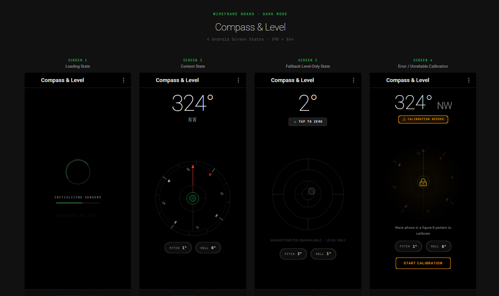

# DESIGN: Compass & Level (App A)
**Design Gate:** Gate 1B (Screen States & Layout Specifications)

## Visual Board (Gate 1B)

---

## 1. Design Tokens & Palette

| Token | Hex Value | Purpose |
| :--- | :--- | :--- |
| `Background` | `#000000` | Obsidian dark canvas, true OLED black |
| `SurfaceElevated` | `#0D0D0E` | Bottom ad banner reservation container |
| `TextPrimary` | `#FFFFFF` | Primary heading/degree readouts |
| `TextSecondary` | `#8E8E93` | Cardinal direction, subheaders, status tags |
| `TextMuted` | `#636366` | Pitch/Roll labels, boundary crosshairs |
| `AccentGreen` | `#34C759` | Level snap at ±0.5°, haptic feedback trigger |
| `AccentAmber` | `#FF9F0A` | Unreliable magnetic sensor warning pill |
| `AccentRed` | `#FF3B30` | North index pointer, fatal error indicator |

---

## 2. Documented Screen States
1. **Screen 1 (Loading State):** Minimalist center loading indicator (`INITIALIZING SENSORS`) while registering hardware sensors.
2. **Screen 2 (Content State):** Full rotating compass rose with real-time degrees (`324° NW`), spirit level snap ring, and monospace pitch/roll metric pills.
3. **Screen 3 (Fallback Level-Only State):** Graceful fallback for devices lacking a magnetometer (`R8VY4007A1P`). Dial hidden, reticle active, and `TAP TO ZERO` tare interaction prominent.
4. **Screen 4 (Error / Sensor Unreliable):** Heading lock indicator, amber `CALIBRATION NEEDED` pill, and figure-8 motion instructions to resolve magnetic distortion.
